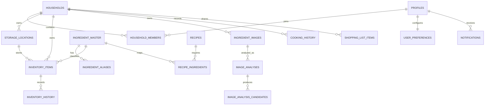

# 데이터 모델

## 핵심 관계

## 수량 모델

| 타입 | 저장 | 제약 |
|---|---|---|
| `COUNTABLE` | `quantity`, `unit` | `remaining_level` 사용 금지 |
| `LEVEL` | `remaining_level`, 선택적 `remaining_percent` | `quantity` 사용 금지 |
| `MEASURABLE` | 사용자가 입력한 `quantity`, `unit` | AI 후보의 정확한 값 생성 금지 |

master의 타입은 UI 시작값이며 inventory item에서 변경할 수 있다.

## 삭제와 보존

- `inventory_items`, `storage_locations`, 이미지, 알림 등 사용자 데이터는 `deleted_at`을 사용한다.
- 재고 이력과 조리 기록은 원본 항목의 상태 변경 뒤에도 남는다.
- 계정 탈퇴는 `deletion_scheduled_at`으로 30일 유예를 표현한다. 탈퇴 Edge Function은 Auth 계정을 30일 ban하고 refresh token을 폐기하며, RLS는 soft-delete 즉시 데이터 접근을 차단한다. `expiry-scan`은 기한 도래 시 Storage 원본과 Auth 사용자를 삭제한다.
- household 유일 OWNER의 탈퇴는 위임 또는 household 삭제 선택 없이는 진행하지 않는다.

## 인덱스

- 재고: `(household_id, deleted_at, expiration_date)`, `(household_id, storage_location_id)`
- alias: 정규화 문자열의 `GIN + pg_trgm`
- 분석 후보: `(analysis_id)`
- 장보기: `(household_id, status)`
- 알림: `(user_id, read_at)`

## RLS 분류

- 개인: profiles, preferences, notifications, favorites → `auth.uid()`
- household: 재고, 공간, 이미지, 분석, 조리, 장보기 → membership
- 카탈로그: master, aliases, substitutions, recipes → authenticated read-only
- Storage: 첫 경로 segment가 접근 가능한 household UUID인 private object만 허용
