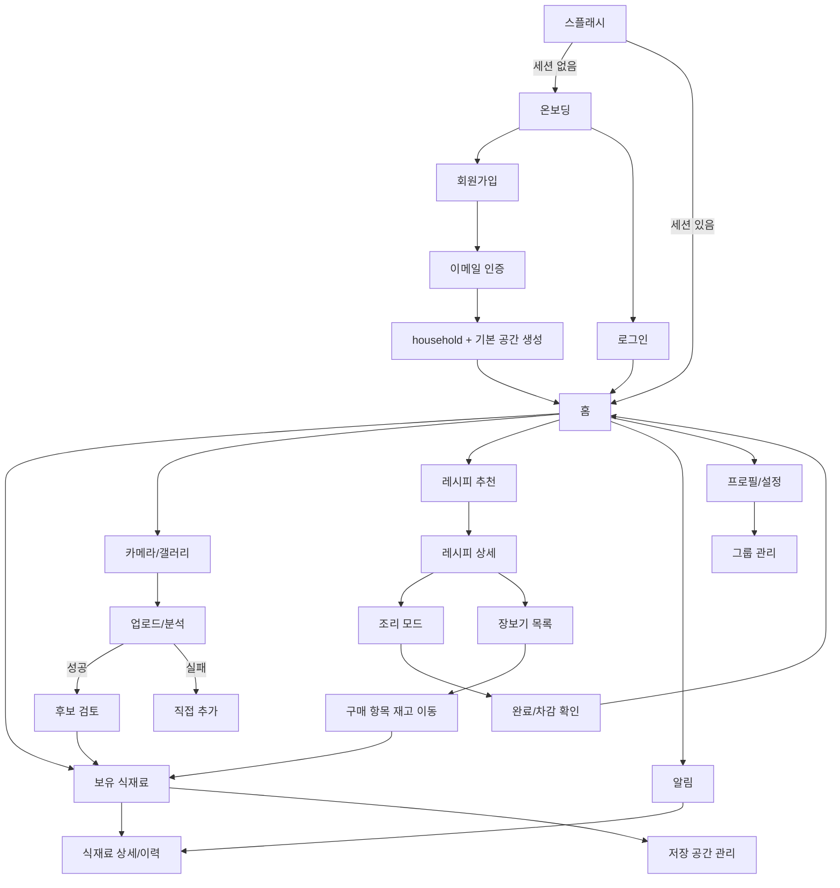

# 화면 흐름

```mermaid
flowchart TD
  Splash[스플래시] -->|세션 없음| Onboarding[온보딩]
  Splash -->|세션 있음| Home[홈]
  Onboarding --> Signup[회원가입]
  Onboarding --> Login[로그인]
  Signup --> Verify[이메일 인증]
  Verify --> Household[household + 기본 공간 생성]
  Household --> Home
  Login --> Home

  Home --> Inventory[보유 식재료]
  Home --> Capture[카메라/갤러리]
  Capture --> Analyze[업로드/분석]
  Analyze -->|성공| Review[후보 검토]
  Analyze -->|실패| Manual[직접 추가]
  Review --> Inventory
  Inventory --> Detail[식재료 상세/이력]
  Inventory --> Storage[저장 공간 관리]

  Home --> Recipes[레시피 추천]
  Recipes --> RecipeDetail[레시피 상세]
  RecipeDetail --> Cook[조리 모드]
  Cook --> Deduct[완료/차감 확인]
  Deduct --> Home

  RecipeDetail --> Shopping[장보기 목록]
  Shopping --> Move[구매 항목 재고 이동]
  Move --> Inventory

  Home --> Notifications[알림]
  Notifications --> Detail
  Home --> Settings[프로필/설정]
  Settings --> Group[그룹 관리]
```

모든 데이터 화면은 정상, 빈 상태, 스켈레톤 로딩, 재시도 가능한 오류 상태를 갖는다. 검토 화면 이탈 시 Zustand draft를 보존하며, 오프라인 쓰기는 비활성화하고 캐시된 읽기만 제공한다.

